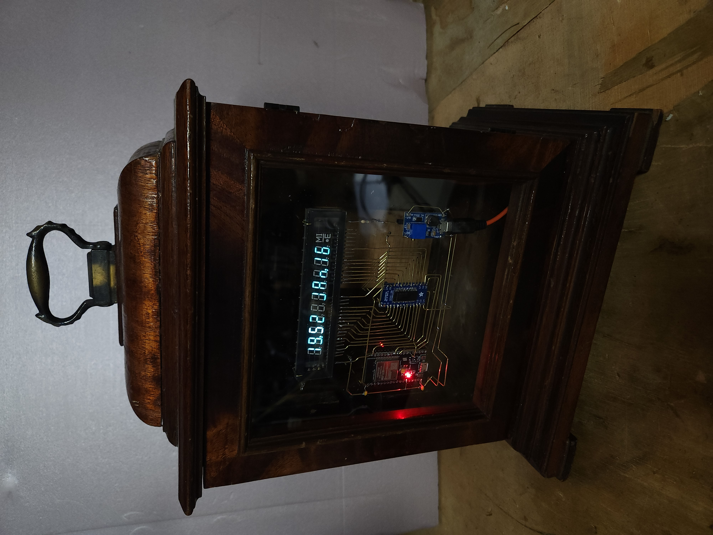

# "Bare Soul of My Circuit" aka. Gustav VFD Clock — ESP-IDF Port

An ESP-IDF port of [GustavClock](https://github.com/v01dma1n/GustavClock) — a 10-digit VFD clock driven by a MAX6921 chip over VSPI SPI. Features automatic NTP time synchronization, weather display from OpenWeatherMap, and a web-based configuration portal. Built on the shared `esp32_ntp_clock` IDF component framework also used by [MoodWhisperer](https://github.com/v01dma1n/MoodWhisperer).



## ✨ Features

- **10-Digit VFD Display:** Driven by a MAX6921 chip over VSPI SPI with hardware-accurate digit multiplexing.
- **Automatic Time Sync:** Connects to your WiFi and synchronizes from an NTP server with full timezone support.
- **Weather Display:** Fetches current temperature (°F or °C) and humidity from OpenWeatherMap.
- **Animated Scenes:** Cycles through date, time, temperature, and humidity using a playlist of animations — Slot Machine, Matrix, Scrolling Text.
- **Web Configuration:** On first boot or when WiFi fails, the clock enters AP mode. Connect to its network and open `192.168.4.1` to configure all settings.

## ⚙️ Hardware

| Part | Details |
|------|---------|
| ESP32 module | ESP32-WROOM dev board |
| VFD display | 10-digit Vacuum Fluorescent Display |
| VFD driver | MAX6921 (VSPI: SCLK=18, MOSI=23, SS=5, BLANK=0) |
| RTC | DS1307 over I2C (SDA=21, SCL=22) — supported in firmware, not installed |
| Power | 5 V supply for ESP32 + VFD |

## 🧩 Component Architecture

```
GustavClock2/
├── components/
│   ├── esp32_ntp_clock/          # Shared clock engine (IDF port of ESP32NTPClock)
│   │   ├── display_manager, scene_manager, clock_fsm_manager
│   │   ├── wifi_connector, sntp_client, geo_tz_client
│   │   ├── weather_client, boot_manager, animations …
│   └── esp32_ntp_clock_drivers/  # Hardware drivers
│       ├── disp_driver_max6921   # MAX6921 VFD driver (SPI, digit multiplexing)
│       └── ds1307_driver         # DS1307 RTC driver (I2C)
└── main/
    ├── gustav_app                # GustavApp singleton, scene playlist
    ├── gustav_preferences        # NVS-backed config (WiFi, OWM, timezone …)
    ├── gustav_access_point_manager
    └── gustav_weather_manager
```

## 🛠️ Configuration

1. **First Boot:** The clock starts in AP mode. The display scrolls `SETUP MODE — JOIN gustav-clock`.
2. **Connect to the AP:** Join the WiFi network **`gustav-clock`**.
3. **Open the portal:** Navigate to **`192.168.4.1`** in your browser.
4. **Enter settings:**
   - WiFi SSID and password
   - [POSIX timezone string](https://remotemonitoringsystems.ca/time-zone-list.php) (e.g. `CST6CDT,M3.2.0,M11.1.0`)
   - OpenWeatherMap API key
   - City/location (e.g. `Chicago,IL,US`)
   - Temperature unit (°F or °C)
5. **Save:** Click *Save and Restart*. The clock reboots and connects to your WiFi.

To re-enter configuration mode at any time, press the **reset button twice** in quick succession (about 1 second apart).

## 🚀 Building

Requires [ESP-IDF v5.x](https://docs.espressif.com/projects/esp-idf/en/stable/esp32/get-started/index.html).

```bash
git clone https://github.com/v01dma1n/GustavClock2.git
cd GustavClock2
idf.py set-target esp32
idf.py build
idf.py -p /dev/ttyUSB0 flash monitor
```

`sdkconfig.defaults` is included — no manual `menuconfig` needed for normal builds.

## 🔑 Differences from GustavClock (Arduino)

| | GustavClock (Arduino) | GustavClock2 (ESP-IDF) |
|---|---|---|
| Framework | Arduino / PlatformIO | ESP-IDF v5 |
| SPI driver | `SPIClass` | `spi_master` IDF driver |
| NVS / prefs | `Preferences` | `nvs_flash` IDF API |
| RTC | not present | DS1307 supported in firmware, not currently installed |
| AP trigger | double-reset via BootManager | double-reset via BootManager |
| Weather | `IWeatherClock` + `openweather_client` | `fetchWeather()` from `weather_client.h` |
| Timezone | separate state + country code fields | single `owm_city` field, e.g. `Chicago,IL,US` |

## 📜 License

MIT License — see `LICENSE` for details.
